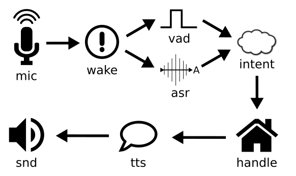

**NOTE: This is a very early developer preview!**

An open source toolkit for building voice assistants.

Rhasspy focuses on:

* Privacy - no data leaves your computer unless you want it to
* Broad language support - more than just English
* Customization - everything can be changed

## Getting Started

* Check out the [tutorial](docs/tutorial.md)
* Connect Rhasspy to [Home Assistant](docs/home_assistant.md)
   * Install the [Rhasspy 3 add-on](https://github.com/rhasspy/hassio-addons)
* Run one or more [satellites](docs/satellite.md)
* Join [the community](https://community.rhasspy.org/)

## Missing Pieces

This is a developer preview, so there are lots of things missing:

* A user friendly web UI
* An automated method for installing programs/services and downloading models
* Support for custom speech to text grammars
* Intent systems besides Home Assistant
* The ability to accumulate context within a pipeline

## Core Concepts

### Domains

Rhasspy is organized by [domain](docs/domains.md):

* mic - audio input
* wake - wake word detection
* asr - speech to text
* vad - voice activity detection
* intent - intent recognition from text
* handle - intent or text input handling
* tts - text to speech
* snd - audio output

### Programs

Rhasspy talks to external programs using the [Wyoming protocol](docs/wyoming.md). You can add your own programs by implementing the protocol or using an [adapter](#adapters).

### Adapters

[Small scripts](docs/adapters.md) that live in `bin/` and bridge existing programs into the [Wyoming protocol](docs/wyoming.md).

For example, a speech to text program (`asr`) that accepts a WAV file and outputs text can use `asr_adapter_wav2text.py`

### Pipelines

Complete voice loop from microphone input (mic) to speaker output (snd). Stages are:

1. detect (optional)
    * Wait until wake word is detected in mic
2. transcribe
    * Listen until vad detects silence, then convert audio to text
3. recognize (optional)
    * Recognize an intent from text
4. handle
    * Handle an intent or text, producing a text response
5. speak
    * Convert handle output text to speech, and speak through snd

### Servers

Some programs take a while to load, so it's best to leave them running as a server. Use `bin/server_run.py` or add `--server <domain> <name>` when running the HTTP server.

See `servers` section of `configuration.yaml` file.

---

## Supported Programs

* mic
    * [arecord](https://alsa-project.org/wiki/Main_Page)
    * [parecord](https://www.freedesktop.org/wiki/Software/PulseAudio/)
    * [gstreamer_udp](https://gstreamer.freedesktop.org/)
    * [sounddevice](https://python-sounddevice.readthedocs.io)
    * [pyaudio](https://people.csail.mit.edu/hubert/pyaudio/docs/)
* wake 
    * [porcupine1](https://github.com/Picovoice/porcupine)
    * [precise-lite](https://github.com/mycroftAI/mycroft-precise)
    * [snowboy](https://github.com/Kitt-AI/snowboy)
* vad
    * [silero](https://github.com/snakers4/silero-vad)
    * [webrtcvad](https://pypi.org/project/webrtcvad/)
* asr 
    * [whisper](https://github.com/openai/whisper)
    * [whisper-cpp](https://github.com/ggerganov/whisper.cpp/)
    * [faster-whisper](https://github.com/guillaumekln/faster-whisper/)
    * [vosk](https://alphacephei.com/vosk/)
    * [coqui-stt](https://stt.readthedocs.io)
    * [pocketsphinx](https://github.com/cmusphinx/pocketsphinx)
* handle
    * [home_assistant_conversation](https://www.home-assistant.io/docs/assist)
* tts 
    * [piper](https://github.com/rhasspy/piper/)
    * [mimic3](https://github.com/mycroftAI/mimic3)
    * [larynx](https://github.com/rhasspy/larynx/)
    * [coqui-tts](https://tts.readthedocs.io)
    * [marytts](http://mary.dfki.de/)
    * [flite](http://www.festvox.org/flite/)
    * [festival](http://www.cstr.ed.ac.uk/projects/festival/)
    * [espeak-ng](https://github.com/espeak-ng/espeak-ng/)
* snd
    * [aplay](https://alsa-project.org/wiki/Main_Page)
    * [paplay](https://www.freedesktop.org/wiki/Software/PulseAudio/)
    * [gstreamer_udp](https://gstreamer.freedesktop.org/)
    
    
---

## HTTP API

`http://localhost:13331/<endpoint>`

Unless overridden, the pipeline named "default" is used.

* `/pipeline/run`
    * Runs a full pipeline from mic to snd
    * Produces JSON
    * Override `pipeline` or:
        * `wake_program`
        * `asr_program`
        * `intent_program`
        * `handle_program`
        * `tts_program`
        * `snd_program`
    * Skip stages with `start_after`
        * `wake` - skip detection, body is detection name (text)
        * `asr` - skip recording, body is transcript (text) or WAV audio
        * `intent` - skip recognition, body is intent/not-recognized event (JSON)
        * `handle` - skip handling, body is handle/not-handled event (JSON)
        * `tts` - skip synthesis, body is WAV audio
    * Stop early with `stop_after`
        * `wake` - only detection
        * `asr` - detection and transcription
        * `intent` - detection, transcription, recognition
        * `handle` - detection, transcription, recognition, handling
        * `tts` - detection, transcription, recognition, handling, synthesis
* `/wake/detect`
    * Detect wake word in WAV input
    * Produces JSON
    * Override `wake_program` or `pipeline`
* `/asr/transcribe`
    * Transcribe audio from WAV input
    * Produces JSON
    * Override `asr_program` or `pipeline`
* `/intent/recognize`
    * Recognizes intent from text body (POST) or `text` (GET)
    * Produces JSON
    * Override `intent_program` or `pipeline`
* `/handle/handle`
    * Handles intent/text from body (POST) or `input` (GET)
    * `Content-Type` must be `application/json` for intent input
    * Override `handle_program` or `pipeline`
* `/tts/synthesize`
    * Synthesizes audio from text body (POST) or `text` (GET)
    * Produces WAV audio
    * Override `tts_program` or `pipeline`
* `/tts/speak`
    * Plays audio from text body (POST)  or `text` (GET)
    * Produces JSON
    * Override `tts_program`, `snd_program`, or `pipeline`
* `/snd/play`
    * Plays WAV audio via snd
    * Override `snd_program` or `pipeline`
* `/config`
    * Returns JSON config
* `/version`
    * Returns version info

## WebSocket API

`ws://localhost:13331/<endpoint>`

Audio streams are raw PCM in binary messages.

Use the `rate`, `width`, and `channels` parameters for sample rate (hertz), width (bytes), and channel count. By default, input audio is 16Khz 16-bit mono, and output audio is 22Khz 16-bit mono.

The client can "end" the audio stream by sending an empty binary message.

* `/pipeline/asr-tts`
    * Run pipeline from asr (stream in) to tts (stream out)
    * Produces JSON messages as events happen
    * Override `pipeline` or:
        * `asr_program`
        * `vad_program`
        * `handle_program`
        * `tts_program`
    * Use `in_rate`, `in_width`, `in_channels` for audio input format
    * Use `out_rate`, `out_width`, `out_channels` for audio output format
* `/wake/detect`
    * Detect wake word from websocket audio stream
    * Produces a JSON message when audio stream ends
    * Override `wake_program` or `pipeline`
* `/asr/transcribe`
    * Transcribe a websocket audio stream
    * Produces a JSON message when audio stream ends
    * Override `asr_program` or `pipeline`
* `/snd/play`
    * Play a websocket audio stream
    * Produces a JSON message when audio stream ends
    * Override `snd_program` or `pipeline`
