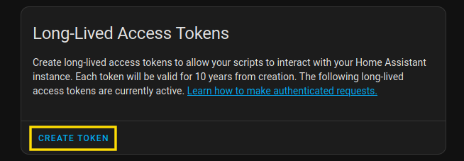

# Home Assistant

This will connect Rhasspy to Home Assistant via [Assist](https://www.home-assistant.io/docs/assist).

Install the Home Assistant intent handler:

```sh
mkdir -p config/programs/handle/
cp -R programs/handle/home_assistant config/programs/handle/
```

Create a long-lived access token in Home Assistant (inside your profile):



Copy the **entire** access token (with CTRL+A, not just selecting what you can see) and put it in the data directory:

```sh
mkdir -p config/data/handle/home_assistant/
echo "MY-LONG-LIVED-ACCESS-TOKEN" > config/data/handle/home_assistant/token
```

Add to your `configuration.yaml`:


```yaml
programs:
  handle:
    home_assistant:
      command: |
        bin/converse.py --language "${language}" "${url}" "${token_file}"
      adapter: |
        handle_adapter_text.py
      template_args:
        url: "http://localhost:8123/api/conversation/process"
        token_file: "${data_dir}/token"
        language: "en"

pipelines:
  default:
    mic: ...
    vad: ...
    asr: ...
    wake: ...
    handle:
      name: home_assistant
    tts: ...
    snd: ...
```

Make sure your Home Assistant server is running, and test out a command:

```sh
script/run bin/handle_text.py "Turn on the bed light"
```

Replace "bed light" with the name of a device you have connected to Home Assistant.

If successful, you should see JSON printed with the response text, like:

```sh
{"type": "handled", "data": {"text": "Turned on light"}}
```

This also works over HTTP:

```sh
curl -X POST --data 'Turn on the bed light' 'localhost:13331/handle/handle'
```

Now you can run your full pipeline and control Home Assistant!
